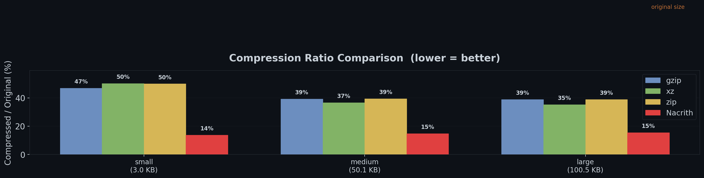
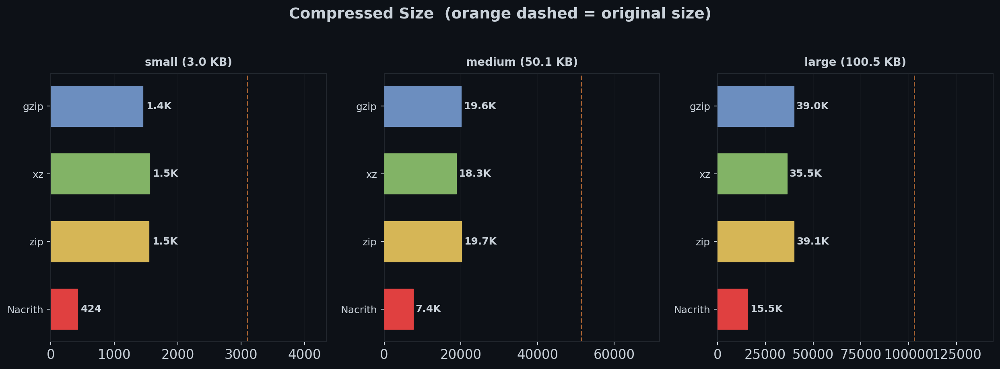
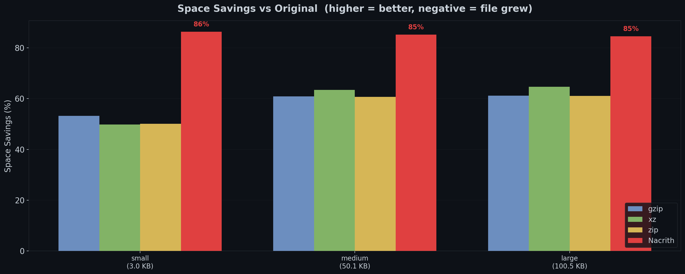

<p align="center">
  
</p>

<p align="center">
  <a href="https://nacrith.com">Website</a> · <a href="assets/nacrith_paper.pdf">Technical Paper (PDF)</a> · <a href="https://huggingface.co/spaces/robtacconelli/Nacrith">Try on Hugging Face</a>
</p>

### Neural Arithmetic Compression — A Game-Changer in Text Encoding

**Nacrith** is a **state-of-the-art lossless** text compression system that delivers exceptional results by combining the predictive power of a neural language model with the mathematical precision of arithmetic coding. Where traditional compressors see bytes, Nacrith *understands language* — achieving compression ratios **far below the classical Shannon entropy limits** and **3-4x better than gzip, xz, and zip**.

At its core, Nacrith pairs a small but capable LLM ([SmolLM2-135M](https://huggingface.co/HuggingFaceTB/SmolLM2-135M), 135M parameters) with an arithmetic encoder. The LLM reads text token by token and, at each step, predicts *how likely every possible next token is*. These probability predictions are fed directly into the arithmetic coder, which assigns shorter bit sequences to likely tokens and longer ones to surprises. Because the LLM captures grammar, semantics, and world knowledge — not just local byte patterns — it predicts with far higher confidence than dictionary-based methods, resulting in dramatically fewer bits per token. Both compressor and decompressor run the **exact same model**, so predictions are identical on both sides, guaranteeing **perfect lossless reconstruction**.

---

## Benchmark Results

Tested on English prose of varying sizes. GPU: NVIDIA GTX 1050 Ti.

| Sample | Original | gzip | xz | zip | Nacrith |
|--------|----------|------|----|-----|---------|
| small | 3.0 KB | 1.4 KB (46.8%) | 1.5 KB (50.2%) | 1.5 KB (49.9%) | **424 B (13.7%)** |
| medium | 50.1 KB | 19.6 KB (39.2%) | 18.3 KB (36.6%) | 19.7 KB (39.3%) | **7.4 KB (14.8%)** |
| large | 100.5 KB | 39.0 KB (38.9%) | 35.5 KB (35.3%) | 39.1 KB (38.9%) | **15.5 KB (15.4%)** |

*Percentages = compressed / original (lower is better).*

### Compression Ratio (% of original size)



### Compressed Size



### Space Savings



### Key Observations

- **Nacrith achieves ~14-15% ratio** on English text — roughly **2.5x better than gzip** and **2.3x better than xz**, even at the 100KB scale.
- Nacrith saves **85% of space** consistently across all tested sizes, while gzip saves ~53-61% and xz saves ~50-65%.
- Trade-off: compression speed is slower (~21 tokens/sec on GPU) since each token requires a neural network forward pass. Benchmarks were run on a low-end NVIDIA GTX 1050 Ti — with a modern GPU, compression and decompression would be significantly faster.
- The model uses ~1.3 GB of VRAM during compression/decompression, so any CUDA-capable GPU with at least 2 GB of VRAM will work. Falls back to CPU if no GPU is available.
- All results are **fully lossless** — decompressed output matches the original byte-for-byte.

### Beyond the Shannon Entropy Limit

Nacrith doesn't just beat traditional compressors — it compresses **well below the classical Shannon entropy bounds** of the source data. On the 100KB benchmark file:

| Method | Size | bits/byte |
|--------|------|-----------|
| Original | 100.5 KB | 8.0000 |
| Shannon 0th-order limit | 59.5 KB | 4.7398 |
| Shannon 1st-order limit | 44.2 KB | 3.5213 |
| Shannon 2nd-order limit | 34.4 KB | 2.7373 |
| gzip -9 | 39.0 KB | 3.1082 |
| xz -9 | 35.5 KB | 2.8257 |
| **Nacrith** | **15.5 KB** | **1.2355** |

Nacrith achieves **1.24 bits/byte** — **74% below** the 0th-order Shannon limit, **65% below** the 1st-order (bigram) limit, and **55% below** even the 2nd-order (trigram) limit. This is state-of-the-art compression performance: it proves the neural model captures deep linguistic structure — grammar, semantics, long-range context — that no frequency-based or dictionary-based method can exploit. For comparison, gzip and xz both hover *above* the 2nd-order Shannon limit, unable to break through the statistical ceiling that Nacrith shatters.

> Run `python shannon_analysis.py` to reproduce this analysis on any text file.

---

## How It Works

Nacrith exploits the deep connection between **prediction** and **compression** (Shannon, 1948): a good predictor of text can be turned into a good compressor.

### The LLM + Arithmetic Coding Pipeline

**The LLM** (SmolLM2-135M) is a transformer neural network trained on large amounts of text. Given a sequence of tokens, it outputs a probability distribution over the entire vocabulary (~49K tokens) for what comes next. It captures grammar, common phrases, semantic relationships, and world knowledge — far beyond simple byte-pattern matching.

**Arithmetic coding** is a mathematically optimal encoding scheme that maps a sequence of symbols to a single number in the interval `[0, 1)`. For each symbol, it narrows the interval proportionally to that symbol's probability. High-probability symbols barely shrink the interval (costing almost zero bits), while unlikely symbols shrink it a lot (costing many bits). The final interval width determines the total compressed size.

**Together**: the LLM provides the probabilities, the arithmetic coder turns them into bits. The better the LLM predicts, the fewer bits are needed. A token predicted at 99% confidence costs only ~0.014 bits. A token at 50% costs 1 bit. Only truly surprising tokens are expensive.

### Compression

```
Input text --> Tokenize --> For each token:
                              1. LLM predicts P(next token | context)
                              2. Arithmetic encoder narrows interval by P(actual token)
                           --> Compressed bitstream
```

### Decompression

```
Compressed bits --> For each position:
                      1. Same LLM predicts same P(next token | context)
                      2. Arithmetic decoder recovers token from interval + bits
                      3. Recovered token feeds back as context
                   --> Tokens --> Detokenize --> Original text
```

Both sides run the **exact same model with the exact same weights**, producing identical probability distributions. This symmetry guarantees perfect lossless reconstruction.

### Why Nacrith Beats Traditional Compressors

- **gzip/xz/zip** use pattern matching on raw bytes within a sliding window. They only exploit local, literal repetitions.
- **Nacrith** captures semantic and syntactic structure. It "knows" that after *"The President of the United"*, the word *"States"* is extremely likely — even if that exact phrase never appeared recently. This deep understanding of language produces far better predictions, which directly translates to fewer bits.

---

## Binary File Compression (NC02)

Nacrith also supports compressing **binary files** such as PDFs, executables, and other non-UTF-8 data using a hybrid chunked approach. Binary mode is activated automatically when the input file is not valid UTF-8.

### How It Works

Binary files are rarely pure binary — they often contain significant amounts of embedded text (strings, metadata, markup, code). Nacrith exploits this by **segmenting** the input into text and binary chunks, then compressing each with the best method for its type.

**1. Byte classification and segmentation**

Every byte is classified as text-like (printable ASCII 32-126, plus tab/LF/CR) or binary. Contiguous runs of the same type are grouped, then refined through several passes:

- Short text runs (< 64 bytes) are demoted to binary — too small to benefit from neural compression.
- Small binary gaps (< 8 bytes) between text runs are bridged — keeping the text chunk contiguous.
- Small binary chunks (< 64 bytes) adjacent to text are absorbed — avoiding fragment overhead.

The result is a clean sequence of alternating text and binary chunks.

**2. Binary blob compression**

All binary chunks are merged into a single blob and compressed with **lzma** (for blobs >= 4 KB) or **gzip** (for smaller blobs). If neither reduces the size, the raw bytes are stored as-is.

**3. Neural text compression**

Each text chunk is decoded as Latin-1 and compressed individually using the same LLM + arithmetic coding pipeline as pure text mode. The model resets its context between chunks.

**4. NC02 file format**

The compressed output uses the `NC02` format:

| Section | Description |
|---------|-------------|
| File header (12 bytes) | Magic `NC02` + version (uint32) + entry count (uint32) |
| Entry table | Per chunk: type byte (`T`/`B`) + original length (uint32) |
| Binary section | Compression method (`G`/`L`/`R`) + compressed length + data |
| Text streams | Per text chunk: token count + bit count + stream length + arithmetic-coded data |

### Compression effectiveness on binary files

The compression ratio on binary files depends heavily on the **proportion of meaningful text** in the file. Files with large text regions (e.g., PDFs with embedded text content, HTML, XML, source code archives) will see significant compression gains on those regions. Files that are mostly opaque binary data (images, video, already-compressed archives) will see little to no improvement over gzip/lzma, since the neural model cannot predict non-text byte patterns.

| File type | Expected result |
|-----------|----------------|
| Text-heavy PDFs, HTML, XML | Good — large text chunks benefit from neural compression |
| Source code archives | Good — code is highly predictable for the LLM |
| Compressed archives (zip, gz) | Poor — already compressed, no text to exploit |
| Images, video, audio | Poor — almost entirely binary, falls back to gzip/lzma |

---

## Project Structure

```
Nacrith/
├── arithmetic_coder.py    # Arithmetic encoder/decoder (32-bit precision)
├── model_wrapper.py       # SmolLM2-135M wrapper with GPU/CPU fallback
├── compressor.py          # NeuralCompressor class (NC01 text + NC02 binary)
├── cli.py                 # Command-line interface
├── utils.py               # CDF conversion, helpers
├── benchmark.py           # Benchmark script
├── generate_charts.py     # Generates chart images in assets/
├── shannon_analysis.py    # Shannon entropy analysis vs Nacrith
├── pytest.ini             # Test configuration
├── assets/                # Chart images for README
└── tests/
    ├── conftest.py        # Shared fixtures
    ├── test_arithmetic.py # Arithmetic coder tests (fast, no model)
    ├── test_chunking.py   # Binary segmentation tests (fast, no model)
    ├── test_model.py      # Model wrapper tests (slow)
    └── test_compressor.py # Full pipeline tests (slow)
```

## Installation

### Requirements

- Python 3.10+
- NVIDIA GPU with CUDA support (optional, falls back to CPU)
- ~500 MB disk space for the model (downloaded automatically on first run)

### Setup

```bash
# Clone the repository
git clone https://github.com/st4ck/Nacrith.git
cd Nacrith

# Create and activate virtual environment
python3 -m venv venv
source venv/bin/activate

# Install dependencies
pip install torch --index-url https://download.pytorch.org/whl/cu118  # For CUDA 11.8 GPUs
# OR for CPU-only:
# pip install torch --index-url https://download.pytorch.org/whl/cpu

pip install transformers accelerate

# Install test dependencies
pip install pytest
```

> **Note on GPU compatibility:** If you have an older NVIDIA GPU (e.g., GTX 1050 Ti with CUDA capability 6.1), use PyTorch with CUDA 11.8 (`cu118`). Newer PyTorch builds with CUDA 12.x may not support older GPU architectures. The system will automatically fall back to CPU if GPU is unavailable.

## Usage

### Compress a text file

```bash
python cli.py compress input.txt output.nc
```

### Compress a binary file

Binary mode is detected automatically when the file is not valid UTF-8:

```bash
python cli.py compress document.pdf output.nc
```

### Decompress a file

```bash
python cli.py decompress output.nc restored.txt
```

### Benchmark against gzip

```bash
python cli.py benchmark input.txt
```

### Run the full benchmark suite

```bash
python benchmark.py
```

### Example session

```
$ echo "The quick brown fox jumps over the lazy dog." > test.txt

$ python cli.py compress test.txt test.nc
Original: 45 B
Tokens: 10
Compressing: 10/10 (100.0%)
Compressed: 19 B
Ratio: 0.4222 (42.2%)
Time: 0.8s

$ python cli.py decompress test.nc restored.txt
Decompressing: 10/10 (100.0%)
Decompressed: 45 B
Time: 0.9s

$ diff test.txt restored.txt && echo "Files match!"
Files match!
```

## Running Tests

```bash
# Fast tests (arithmetic coder only, no model download needed)
python -m pytest tests/test_arithmetic.py -v

# All tests including model-dependent ones (downloads ~259 MB model on first run)
python -m pytest -v -m slow

# All tests
python -m pytest -v
```

## Compressed File Formats

Files use the `.nc` extension (Nacrith Compressed). Two formats are used depending on the input:

### NC01 — Text mode

Used for valid UTF-8 text files.

| Offset | Size | Field | Description |
|--------|------|-------|-------------|
| 0 | 4 bytes | Magic | `NC01` (file identifier) |
| 4 | 4 bytes | Token count | Number of tokens (uint32, big-endian) |
| 8 | 4 bytes | Bit count | Number of compressed bits (uint32, big-endian) |
| 12 | variable | Stream | Arithmetic-coded bitstream |

### NC02 — Binary mode

Used for non-UTF-8 files. See [Binary File Compression](#binary-file-compression-nc02) for details on the hybrid chunked format.

## Limitations

- **Speed**: Compression/decompression requires one neural network forward pass per token. On a GTX 1050 Ti, this is ~21 tokens/second. Much slower than traditional compressors.
- **Model overhead**: The model weights (~259 MB) must be available on both the compressor and decompressor side. This is amortized over many files but makes this impractical for compressing small individual files in isolation.
- **Binary files are not always compressible**: Neural compression excels on text. Binary files only benefit in proportion to their embedded text content. Files that are already compressed (zip, gz, jpeg) or mostly opaque binary data will not compress well — in some cases the output may be larger than the input.
- **Context window**: The model has a 2048-token context window. For very long texts, a chunked sliding window is used, which may slightly reduce compression efficiency at window boundaries.

## Theory

This project implements the insight from Shannon's information theory: **compression is equivalent to prediction**. The better a model predicts the next symbol, the fewer bits are needed to encode it.

The theoretical lower bound for lossless compression is the **entropy** of the source:

```
H(X) = -Σ P(x) log₂ P(x)
```

Arithmetic coding achieves compression rates within a fraction of a bit of the entropy. By using a neural language model that assigns high probabilities to likely tokens, the effective entropy (cross-entropy between the model and the true text distribution) is much lower than what byte-level pattern matching can achieve.

For further reading:
- Shannon, C. E. (1948). *A Mathematical Theory of Communication*
- [Language Modeling Is Compression](https://arxiv.org/abs/2309.10668) (DeepMind, ICLR 2024)
- [LLMZip: Lossless Text Compression using Large Language Models](https://arxiv.org/abs/2306.04050)

## License

Licensed under the Apache License, Version 2.0. See [LICENSE](LICENSE) for details.
